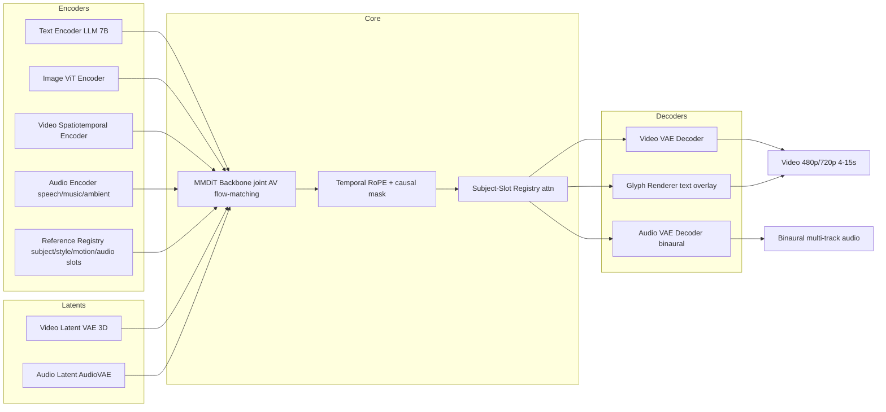

# AV-Forge 2.0 — Architecture

The Seedance 2.0 report keeps exact architecture proprietary. This document specifies a concrete, buildable design inspired by modern video foundations (DiT/MMDiT, flow-matching, hybrid AR+diffusion) that is sufficient to hit the performance targets in `01_DESIGN.md`. It is a **reference design** — components are modular and swappable.

---

## 1. Backbone: Joint Multi-Modal DiT (MMDiT) with Flow-Matching

**Paradigm:** latent flow-matching (rectified-flow family) over a **joint video+audio latent**, conditioned on text/image/video/audio references. A hybrid AR prefix (for shot-planning tokens) feeds the diffusion core.

### 1.1 Why flow-matching over a joint latent
- Native AV output requires **tight temporal sync**. Decoupled "video model + audio model" pipelines (the competitor pattern the report criticizes) produce misalignment. A joint latent with shared temporal axes makes sync a first-class objective.
- Flow-matching gives stable training, easy CFG, and clean distillation paths for the **Fast** variant.

### 1.2 Latent spaces
- **Video latent:** 3D causal VAE (T×H×W×C), downsample 8× spatial, 4× temporal, channels 16. Trained on 480p/720p clips with reconstruction + perceptual + adversarial loss. Anti-aliasing in decoder (see `01_DESIGN.md` §1.8 HF-noise mitigation).
- **Audio latent:** AudioVAE (EnCodec-like) at 24 kHz mono→stereo/binaural, 75 Hz frames, channels 8. Binaural = 2 channels encoded jointly so spatial cues are preserved.
- **Joint token stream:** video tokens and audio tokens are interleaved along the **shared temporal axis** (audio frame rate is upsampled to match video temporal tokens via a learned temporal aligner). This shared axis is what enables frame-accurate AV sync.

### 1.3 Backbone sizing (reference)

| Stage | Layers | Hidden | Heads | Params |
|---|---|---|---|---|
| MMDiT core | 48 | 2048 | 32 | ~7B |
| AR shot-planner prefix | 12 | 2048 | 32 | ~1B (shared embeddings) |
| Text encoder (frozen) | — | — | — | 7B (LLM) |
| Image ViT | 24 | 1024 | 16 | ~0.6B |
| Video encoder | 24 | 1024 | 16 | ~0.8B |
| Audio encoder | 18 | 1024 | 16 | ~0.5B |
| Video VAE | — | — | — | ~0.4B |
| Audio VAE | — | — | — | ~0.2B |

Total trainable core ≈ **8B** (fits the "large-scale efficient" framing; can be trained on 256× H100/B200 with ZeRO-3 + activation checkpointing).

### 1.4 Tokenization & sequence length
- 720p, 15s, 24 fps → 360 frames → 90 temporal tokens after 4× temporal downsample.
- 720p / 8 spatial → 90×128 = 11520 spatial tokens per frame-group → too many. Use **windowed spatial attention** (16×16 windows) + global temporal attention every 4 layers (Swin-style shift). This keeps per-layer cost ~O(N·W²) not O(N²).
- Audio: 75 Hz × 15 s = 1125 frames → 281 tokens after 4× temporal downsample.
- Joint sequence per clip ≈ 90 × (11520/W²) + 281 ≈ manageable with windowed attention.

### 1.5 Conditioning fusion (MMDiT)
- **Double-stream** blocks for text↔AV (like SD3 MMDiT): text tokens and AV tokens attend to each other through cross-stream QKV, then merge.
- **Single-stream** blocks for the AV joint latent: video and audio tokens share the same stream, distinguished by **modality embeddings** + a learned modality-RMSNorm.
- Reference tokens (image/video/audio/style) enter as additional KV streams via the **Reference Registry** (§2).

---

## 2. Reference Registry — the controllability core

This is the component that makes AV-Forge 2.0 support **20+ combinatorial tasks** (matching Seedance 2.0's 20/22 in Table 25, and adding the 7 exclusive tasks the report lists: 3 visual-effects/creative + 4 continuation/extension).

### 2.1 Slots
Each reference input is routed to a typed slot:
- `subject_image` (up to 9) → ViT-encoded, pooled to per-entity tokens with an **entity ID**.
- `subject_video` (up to 3) → spatiotemporal encoder, entity ID carried across frames.
- `motion_video` (up to 3) → motion tokens (appearance-stripped via a style-invariant normalization).
- `style_image` / `style_video` → style tokens (Gram-statistic pooled).
- `vfx_reference` (up to 3) → effect tokens (motion + appearance, not stripped).
- `audio_reference` (up to 3) → audio encoder tokens, tagged with role (dialogue/music/ambient/singing) and **speaker ID**.
- `first_frame` / `last_frame` → anchor tokens for continuation/extension.
- `edit_instruction` → text tokens with an "edit" flag.
- `source_clip` (for editing/continuation/extension) → full AV tokens with a **preserve-mask** indicating non-edited regions.

### 2.2 Registry attention
All reference tokens live in a persistent KV cache. The MMDiT core attends to them via **gated cross-attention** at every block. Gates are per-slot, learned, and initialized near zero so references are injected gradually (training stability).

### 2.3 Subject-slot tracking (fixes multi-subject omission/duplication)
Each entity gets a stable **slot ID**. A small registry head predicts, per generated video token, which slot it belongs to. A **count-consistency reward** (§4) penalizes generating more/fewer entities than slots registered. This directly targets the report's "multi-subject omission / subject duplication" weakness.

### 2.4 Preserve-mask for editing
For editing tasks, the source clip tokens carry a binary mask (1 = keep, 0 = may edit). The backbone uses **mask-aware attention**: edited tokens cannot attend to keep-tokens for content but *can* for context, preventing bleed while preserving non-edited regions (the report's "editing consistency" dimension, target ≥ 3.60).

---

## 3. Temporal modeling & cinematographic reasoning

### 3.1 RoPE-3D + causal mask
- RoPE applied over (T, H, W) with independent frequencies. Temporal frequency scaled to dominate (long-range motion coherence).
- Causal mask over time for the AR shot-planner prefix; full bidirectional within the diffusion core (flow-matching needs global context).

### 3.2 Autonomous shot-planner (AR prefix)
A 12-layer AR model consumes the text prompt + reference summary and emits a **shot plan**: a sequence of shot tokens encoding {shot type, size, camera move, duration, beat, subject focus, audio cue}. This plan conditions the diffusion core. This is what gives the report's "directorial and cinematographic reasoning" — autonomous shot sequencing, pacing, 180°-rule compliance, varied shot sizes, dynamic editing rhythm.

Training signal: shot plans mined from professional footage with shot-detection + camera-grammar tagging; supervised, then refined with a **cinematography reward** (§4).

### 3.3 Camera-grammar constraints (hard)
The shot-planner is constrained by a grammar that forbids:
- axis-crossing (180° rule) within a dialogue scene,
- redundant coverage,
- mismatched shot sizes in sequence,
- uneven pacing (duration variance above a threshold).

Violations are penalized by the cinematography reward. This targets the report's "cinematographic language" sub-dimension (Seedance 2.0 editing rhythm 4.21, framing/composition 4.25 — AV-Forge targets ≥ 4.30).

---

## 4. Training pipeline

### 4.1 Stages
1. **VAE pretraining** (video + audio) — reconstruction-only, large internal + public video/audio.
2. **Backbone pretraining** — flow-matching on joint AV latents, text conditioning, no references. Curriculum: 4s → 8s → 15s; 480p → 720p.
3. **Multi-modal instruction tuning** — enable all reference slots; train on the curated task mix in `03_DATA.md`.
4. **Continuation/extension specialization** — bidirectional bridge-frame training (reverse-played clips); this is the dedicated fix for the report's weakest Seedance 2.0 task.
5. **Post-training alignment** — reward modeling + GRPO (DanceGRPO-style, ref [22]) across all reward heads below.
6. **Fast distillation** — consistency-distill the full model to 4–8 steps; optional CFG-distill.

### 4.2 Reward heads (GRPO)
| Reward | Target dimension |
|---|---|
| Motion-physics (contact/support/momentum) | Motion Quality, physical phenomena |
| Multi-entity count consistency | Multi-Entity Feature Match, continuation |
| Lip-sync (forced-aligner + syncnet) | Audio-Visual Sync, multi-speaker |
| Audio clean (DNSMOS) | Audio Quality |
| Audio-visual beat match (onset alignment) | Audio-Visual Sync |
| OCR text accuracy | Text rendering, edit text restoration |
| Cinematography grammar | Editing rhythm, framing/composition |
| Palette consistency | Continuation color consistency |
| Subject identity (ArcFace/voice embedding) | Reference Alignment |
| Prompt adherence (LLM judge) | Video/Audio Prompt Following |
| Aesthetics (human-preference model) | Aesthetics |
| Safety (CSAM/identity/unwilling-likeness) | output-boundary only |

### 4.3 Losses
- Flow-matching MSE (denoising score) — primary.
- Reconstruction (VAE).
- Perceptual (LPIPS) + adversarial (PatchGAN for video, multi-band MSD for audio).
- Spectral loss (HF-noise mitigation).
- Edit-region preserve loss (mask-aware).
- Count-consistency + palette-consistency auxiliary losses.
- GRPO policy gradient with the reward heads above (post-training only).

### 4.4 Efficiency
- ZeRO-3 + activation checkpointing + CPU offload of frozen encoders.
- Mixed precision (bf16) for backbone, fp32 master weights.
- Curriculum on duration/resolution to keep batch throughput high early.
- Fast variant: 4-step consistency distillation, CFG-distilled, no classifier-free guidance at inference.

---

## 5. Inference

### 5.1 Sampling
- Full: 50-step DPM-Solver-2M + CFG (guidance scale 4–7, per-modality).
- Fast: 4–8 step consistency model, CFG-distilled.

### 5.2 Multi-modal fusion at inference
- CFG over text + each reference slot independently (per-slot guidance scales).
- Reference gates (§2.2) allow fine control: e.g., high subject gate + low style gate for "subject in new style".

### 5.3 Continuation/extension
- **Forward extension:** condition on last K frames of source as "first-frame" anchors; generate forward.
- **Backward extension:** reverse the source, treat as forward extension, reverse output.
- **Continuation (plot):** condition on full source clip summary tokens + new text; generate a new shot that follows.
- **Bridge-frame anchoring:** the first/last generated frame is hard-anchored to the source seam frame via a strong reconstruction term — this is the key fix for Seedance 2.0's weak extension (1.93 TF).

### 5.4 Editing
- Source clip tokens + preserve-mask + edit instruction → backbone regenerates only un-masked regions.
- Reference-image editing: reference image tokens override source appearance in un-masked regions.

### 5.5 Output
- Video VAE decode → 480p/720p frames.
- Audio VAE decode → binaural 24 kHz.
- Optional glyph renderer overlays text (from shot-plan text tokens) with accurate multilingual shaping.
- Optional metadata export (shot plan, per-slot guidance, palette token) for professional pipelines.

---

## 6. Model card fields (for deployment)

| Field | Value |
|---|---|
| Model id | `avforge-2-0-260128` (placeholder) |
| Input | text + ≤9 img + ≤3 vid + ≤3 aud |
| Output | 4–15s AV, 480p/720p, binaural |
| Variants | full, fast |
| Languages | zh, en, ja, ko, id, pt, es + minority/dialects (Sichuan, Northeastern, Cantonese) |
| Safety | output-boundary watermarking + CSAM/identity blocks; core never refuses content type |