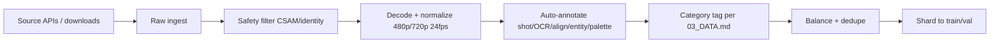

# AV-Forge 2.0 — Data Collection Guide

How to actually gather the training data specified in `03_DATA.md`. This is the operational companion to the curation strategy: concrete sources, tools, licensing, scale, and a runnable collection toolkit (`src/avforge/data/collect.py`).

The 8B model needs roughly **5–10 million** AV clips across the fine-grained categories. This guide assumes you have storage (~50 TB), bandwidth, and (for licensed tiers) budget.

---

## 1. Data tiers & where to get them

### Tier A — Licensed professional (high-quality targets)
| Source | What | How to get | License |
|---|---|---|---|
| Stock footage libraries (Shutterstock, Pond5, Artgrid, Filmpac) | cinematic/TV VFX, ads, lifestyle | API or bulk download subscription | commercial license per clip |
| Music libraries (Epidemic Sound, Artlist, PremiumBeat) | BGM, instruments, singing | subscription API | sync license |
| SFX libraries (Soundsnap, Pro Sound Effects, Boom Library) | foley, ambient, ASMR, animals | bulk download | commercial |
| Opera/dialect recordings | Chinese opera, regional dialects | partner with regional arts orgs / conservatories | custom |
| Multilingual speech (LibriVox, Mozilla Common Voice, Coqui Studio) | en/ja/ko/id/pt/es + minority langs | public APIs | CC0/CC-BY |
| Game cinematics (with publisher permission) | VFX, camera work | partnership | custom |

### Tier B — Public large-scale (breadth)
| Source | What | How | License |
|---|---|---|---|
| Open Video Dataset (Google's Open Images Video) | general video | download shards | CC-BY 4.0 |
| WebVid-10M / Panda-70M (if accessible) | web video with captions | research access | research only — check terms |
| YouTube (via API, with creator permission) | vlogs, tutorials, sports, music | YouTube Data API + `yt-dlp` | creator-owned — must comply with ToS |
| AudioSet (Google) | 2M+ audio clips, 632 classes | download shards | CC-BY 4.0 |
| FMA (Free Music Archive) | music tracks | download | CC variants |
| LibriSpeech / Common Voice | speech | download | CC0/CC-BY |
| Freesound | SFX, ambient, instruments | API | CC variants per clip |
| DNS-Challenge | clean/noisy speech | download | CC |

### Tier C — Synthetic (hard negatives, edge cases)
| Source | What | How |
|---|---|---|
| Procedural VFX (Blender/PyBullet/taichi) | physics sims, fluids, cloth, collisions | render scripts — see `src/avforge/data/synth.py` |
| AV-Forge 1.x + competitor outputs (with license) | hard negatives, deformation clusters | run inference, store with labels |
| Stable Diffusion / SDXL for frames | surreal, counter-reality keyframes | generate + interpolate |
| Forced-aligner-generated multi-speaker | multi-speaker lip-sync hard cases | synthesize with TTS + talking-head models |

### Tier D — Expert-curated (shot-planner supervision)
| Source | What | How |
|---|---|---|
| Professional footage (Tier A subset) | shot detection + camera grammar | auto-tag with `src/avforge/data/annotate.py` |
| Movie/TV shot datasets (MovieShots, ShotNet) | shot boundaries, camera moves | public datasets |

### Tier E — Reference pairs (for R2V tasks)
| Source | What | How |
|---|---|---|
| CelebV-HQ / VoxCeleb2 | (subject image, video of subject) | download + face-crop first frame |
| DAVIS / VSPW | (video, segmentation) for style/motion | download |
| Self-collected | (style image, video in style) | pair Tier A clips with style-transfered frames |
| Audio-visual pairs | (audio clip, video with that audio) | pair AudioSet clips with YouTube videos |

---

## 2. Collection pipeline (end-to-end)



### 2.1 Ingest
- Download via source APIs or `yt-dlp` (with permission).
- Store raw in `data/raw/<source>/<id>.{mp4,wav}` with a manifest CSV.

### 2.2 Safety filter (output-boundary only)
- **CSAM:** PhotoDNA + NCMEC hash matching → remove + report.
- **Non-consensual intimate imagery:** classifier → remove.
- **Unwilling real-person likeness:** face-match against opt-out list → remove.
- **No content-type filtering** — adult/edgy/spicy/violent creative content is **kept** per the spec.

### 2.3 Decode + normalize
- Re-encode everything to a canonical format: H.264, 24 fps, 480p or 720p, AAC 24 kHz stereo.
- Trim to 4–15 s clips (the model's output range).
- Tool: `ffmpeg` (see `collect.py`).

### 2.4 Auto-annotation (the critical step)
Each clip gets labels for every fine-grained category it belongs to. Run `src/avforge/data/annotate.py`:
- **Shot detection + camera grammar:** PySceneDetect + a camera-move classifier (pan/tilt/dolly/zoom/FP/TP).
- **OCR:** EasyOCR on text-bearing frames → text-region masks + transcripts.
- **Forced alignment:** Whisper ASR + Montreal Forced Aligner → per-phoneme timestamps.
- **Speaker/entity IDs:** face clustering (InsightFace) + voice clustering (pyannote) → stable slot IDs.
- **Palette tokens:** color histogram → 16-dim palette embedding.
- **Physics tags:** contact/support/momentum via a lightweight estimator (or ground-truth for sim data).
- **Aesthetics scores:** a human-preference model (pairwise-trained) → 1–5 score.
- **Category tag:** map the above labels to the 30 motion + 17 audio categories in `03_DATA.md`.

### 2.5 Balance + dedupe
- Per-category volume targets from `03_DATA.md` §2.
- Perceptual-hash dedupe (pHash) to remove near-duplicates.
- Minimum floor per rare category (opera, minority languages, ASMR) so they're never starved.

### 2.6 Shard
- Split 95/3/2 → train/val/test, stratified by category.
- Write as WebDataset shards (`.tar`) for efficient streaming training.

---

## 3. Scale & storage

| Item | Estimate |
|---|---|
| Total clips | 5–10 M |
| Avg clip size (720p, 10s, H.264) | ~3 MB |
| Raw storage | ~30 TB |
| Annotated + sharded | ~50 TB (with latents/labels) |
| Manifest DB | ~50 GB (SQLite/Parquet) |

---

## 4. Legal & licensing checklist

- [ ] Per-clip license recorded in manifest (CC0/CC-BY/commercial/custom).
- [ ] YouTube: comply with ToS; only with creator permission or CC-BY videos.
- [ ] Adult/edgy content: only from sources that permit it; record consent/age verification.
- [ ] Person likeness: opt-out list + face-match removal pipeline.
- [ ] Provenance metadata on every clip (source URL, license, acquisition date).
- [ ] Generated outputs carry a watermark at deployment (not training).

---

## 5. Quick start with the toolkit

```bash
# 1. Download a public dataset (example: AudioSet)
python -m avforge.data.collect --source audioset --out data/raw/audioset --limit 1000

# 2. Normalize a batch of raw clips to canonical format
python -m avforge.data.collect --normalize data/raw/myclips --out data/normalized --fps 24 --res 720p

# 3. Auto-annotate a normalized shard
python -m avforge.data.annotate --in data/normalized --out data/annotated

# 4. Balance + shard for training
python -m avforge.data.collect --balance data/annotated --out data/shards --shard-size 1000
```

The toolkit (`src/avforge/data/collect.py`) is a runnable scaffold — it implements the normalize + balance + shard steps now, and has stubs for source-specific downloaders you fill in with your API keys.